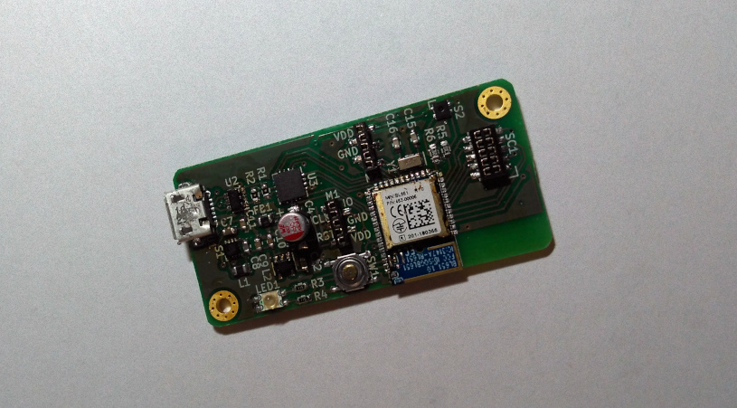

SensorNet Gateway BL651
=======================

A gateway for the SensorNet project, based on the BL651 module.

Functional Test
---------------

+------------------+--------+
| feature          | status |
+==================+========+
| Power Management | OK     |
+------------------+--------+
| SWD              | OK     |
+------------------+--------+
| USB              | OK     |
+------------------+--------+
| LED              | OK     |
+------------------+--------+
| Sensor           | OK     |
+------------------+--------+
